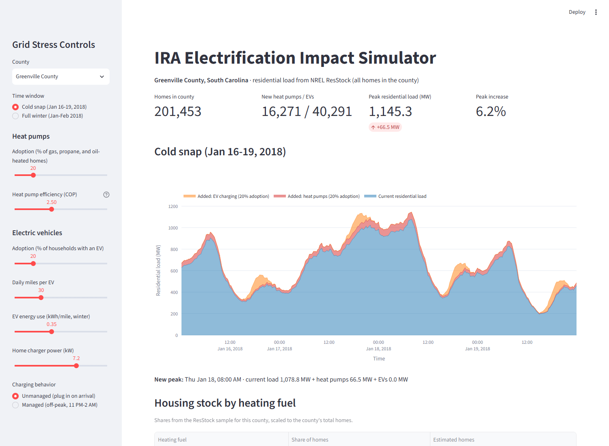

# IRA Grid Stress Simulator

**How much does heat pump adoption under the Inflation Reduction Act raise winter peak load on South Carolina's grid?**



## Why It Matters

Inflation Reduction Act tax credits and rebates make it cheaper for households to replace gas furnaces with electric heat pumps. That cuts emissions, but it also moves heating load onto the electric grid, and heat pumps work hardest on the coldest mornings, which is exactly when the grid is already strained. If adoption clusters in one area, local transformers and feeders can be pushed past their limits.

This tool lets a utility planner pick an area, set an adoption rate, and see how the winter peak changes before the installs happen.

## Approach

1. **Housing stock:** Pull building characteristics (county, square footage, vintage, heating fuel) for South Carolina homes from [NREL ResStock](https://resstock.nrel.gov/) (AMY2018 release, public S3 data lake).
2. **Archetype load profile:** Download 15-minute interval energy data for a representative gas-heated home over 2,500 sq ft.
3. **Electrification:** Convert the home's gas heating energy into added electric load, assuming a heat pump coefficient of performance (COP) of 3.0.
4. **Scaling:** Apply the archetype across every gas-heated home in the selected county at the chosen adoption rate, then compare aggregate load before and after during the January 16–19, 2018 cold snap.


## Dashboard

* **County selector and adoption slider** (0–100% of gas-heated homes switching)
* **Headline metrics:** eligible homes, projected installs, new peak load, and percent increase in peak
* **Cold snap chart:** current vs. projected aggregate load
* **Candidate home list:** gas-heated homes in the county, for targeting outreach or upgrades

## Run It

```bash
git clone https://github.com/livingdw67/grid-stress-simulator.git
cd grid-stress-simulator
pip install -r requirements.txt

python pull_resstock_data.py      # 1. Pull SC housing metadata from NREL (optional: CSV is included)
python analyze_single_home.py     # 2. Build the archetype load profile (optional: CSV is included)
streamlit run app.py              # 3. Launch the dashboard
```

The processed CSVs are committed, so you can go straight to step 3.

## Limitations and Next Steps

* **One archetype home** stands in for every gas-heated home. Next: sample many ResStock buildings per county, or build archetypes by vintage and size.
* **Fixed COP of 3.0.** Real heat pump efficiency drops in cold weather, so the peak impact shown is likely understated. Next: temperature-dependent COP.
* **County as a proxy for a feeder.** True transformer-level analysis needs a utility's feeder and GIS data.
* **Heating only.** EV charging is a natural next layer on the same framework.

## Tech Stack

Python, pandas, PyArrow, s3fs (NREL public S3), Streamlit, Plotly, Matplotlib, Seaborn
